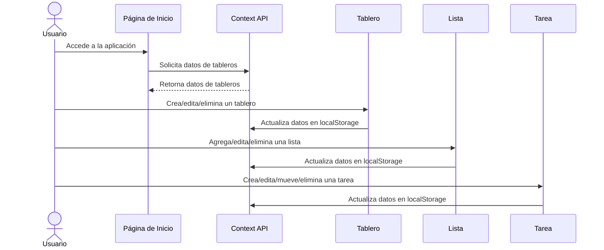

# 📂 Estructura de Carpetas del Proyecto

```
trello-clone/
├── public/               # Archivos estáticos (favicon, imágenes, etc.)
├── src/                  # Código fuente principal
│   ├── components/       # Componentes reutilizables
│   │   ├── Board/        # Componentes relacionados con los tableros
│   │   ├── List/         # Componentes relacionados con las listas
│   │   └── Task/         # Componentes relacionados con las tareas
│   ├── context/          # Manejo del estado global (Context API)
│   ├── hooks/            # Hooks personalizados
│   ├── pages/            # Páginas principales de la aplicación
│   ├── styles/           # Archivos de estilos (CSS/Tailwind)
│   └── utils/            # Utilidades y funciones auxiliares
├── .gitignore            # Archivos y carpetas ignorados por Git
├── package.json          # Dependencias y scripts del proyecto
└── README.md             # Documentación principal del proyecto
```

# 📊 Diagrama UML Dinámico



# 🌳 Diagrama Markmap

```markmap
# Proyecto Trello Clone
## public
- Archivos estáticos (favicon, imágenes, etc.)
## src
- Código fuente principal
  - components
    - Board: Componentes relacionados con los tableros
    - List: Componentes relacionados con las listas
    - Task: Componentes relacionados con las tareas
  - context: Manejo del estado global (Context API)
  - hooks: Hooks personalizados
  - pages: Páginas principales de la aplicación
  - styles: Archivos de estilos (CSS/Tailwind)
  - utils: Utilidades y funciones auxiliares
## .gitignore
- Archivos y carpetas ignorados por Git
## package.json
- Dependencias y scripts del proyecto
## README.md
- Documentación principal del proyecto
```

¡Este archivo ayuda a entender la estructura y el flujo dinámico del proyecto! ✨
